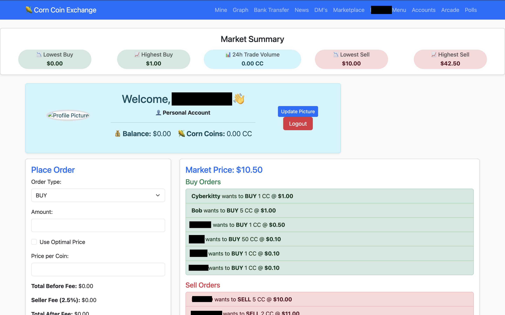
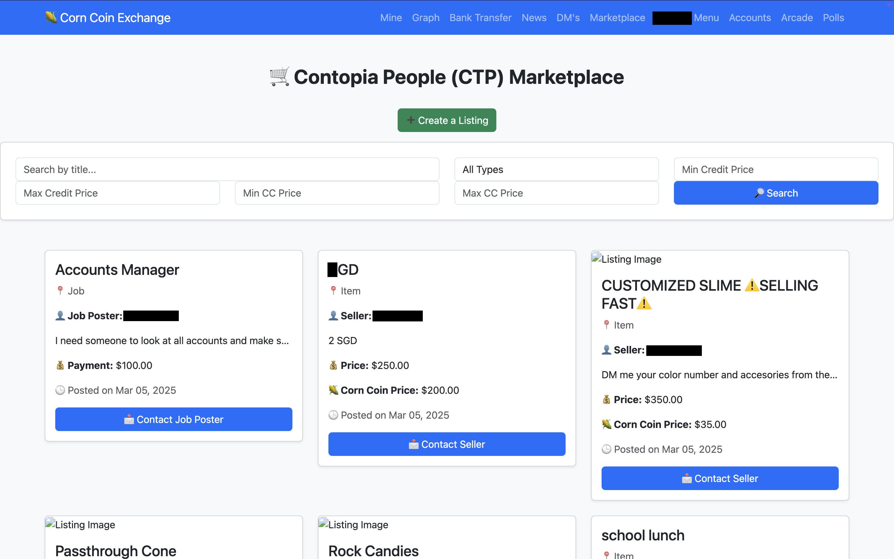
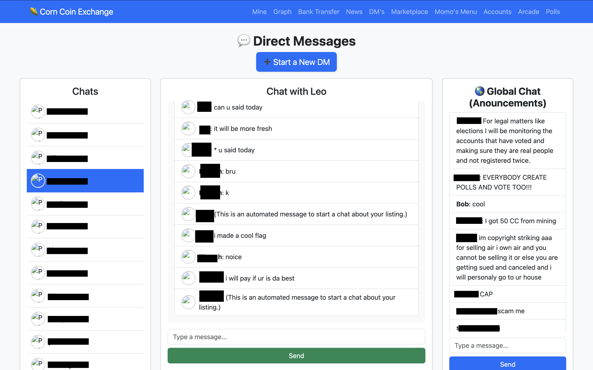
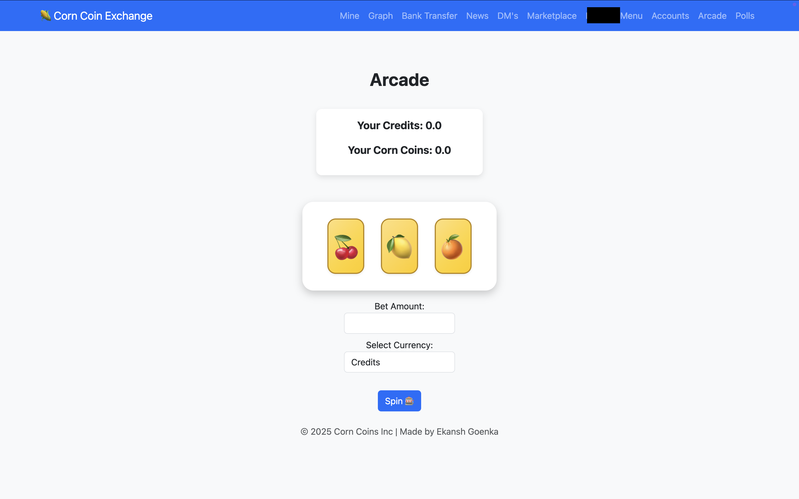
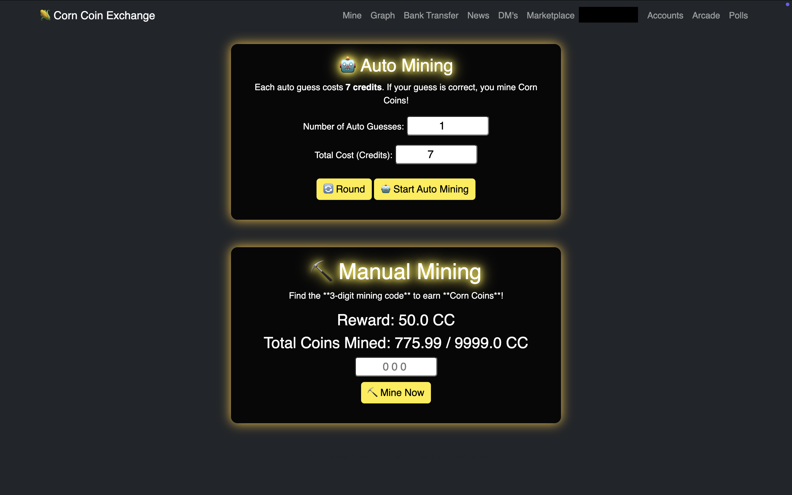
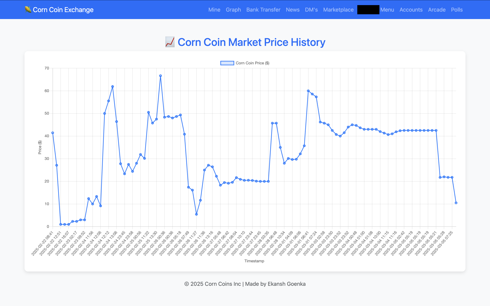

# Corntopia  

Corntopia was a fake country started by me and some friends. We starting tracking stuff on paper and moved to binders. It got complex, and long story short I made a website to manage things, it expanded to a marketplace, encrypted chat room teachers couldn't monitor, cryptocurrency, later even gambling, and it spread across the middle school. At it's peak Corntopia had about 60 citizens (users).

**Sadly all images are gone from the data** (I will come to the reason at the end of the story)
---

## Background  

Before the website, Corntopia had a hand full of citizens. We made stuff up, scribbled on paper and lied, a lot of lying took place. At one point somebody made up a fake cryptocurrency, made a fake graph and arbitrarily made up the price.

To fix this, I built a website to:  
- Manage everyone’s finances.  
- Send and receive money.
- Simulate a REAL cryptocurrency.
- Create a marketplace for buying and selling goods and services to earn money.

Over time, Corntopia grew to 50+ active citizens in our school.  

---

## Features  

### Banking System  

- Citizens could hold currency in **Credits** (our “US dollar”) and **CornCoins** (cryptocurrency).  
- Transfer funds between accounts. 

### Cryptocurrency Exchange  

- Dynamic Pricing: Price decided by the mean of the last 3 transactions (later refined).
- Crypto Exchange: People could place buy and sell orders with a order matching algorithm to fulfill orders.  
- Mining System: Earn CornCoins in exchange for your time using a 3 digit code system.  
- Implemented ideas from real cryptocurrencies to simulate value creation (I spent a lot of time talking to my dad to figure out what gave cryptocurrency value).

### Corntopia People’s Marketplace

- A place for buying and selling goods and services.  
- Users could:  
  - List items like toys, books, or services, like tutoring and stuff.  
  - Negotiate deals with buyers/sellers through the chat system.  
  - Complete transactions using Credits or CornCoins.  
- Inspired by **eBay/Carousell**
- Promoted sustainability by giving old toys and items a second life (excuse for getting caught by teachers).

### Chat System

Just a basic, horribly implemented chat system without web-sockets (I couldn't figure it out at the time), just many API calls to the backend.
Users could, talk and make deals on the chat.

### Fun Extras
- **Arcade** (a.k.a. a rebranded casino).
- **News** a place where journalists could post updates about things happening in the country.
- Regular updates that kept the community engaged.  

---

## Growth  

People in the middle school slowly started finding out about Corntopia. Word of mouth spreads quick when you spend 5 hours a day together.
- Users wanted to earn credits/money to buy cool things from the market place
- They did this by selling old toys and things they didn't like anymore to people who might want them.
- Kinda a MICRO-ECONOMY.

---

## Shutdown  

One day, while “working” on my English essay (actually coding Corntopia), my teacher called me into class. Two big student snitches had told the teacher everything about Corntopia.  

I was told to shut down everything down immediately before things got worse. He brought up words like, fraud, scam and illegal. In a panic (I was very panicked), I deleted the server and database and hide all the evidence.

Luckily, months later, I managed to recover most of the data (except for images, which I’m still bummed about).  

It was fun while it lasted ig.

---

## Legacy  

Although it didn't last forever it was a fun project and it taught me a lot.
- Taught me about **cryptocurrency mechanics**, **economics**, and **community-driven systems**.  
- Helped me practice **Django development**, **databases**, **marketplace logic**, and **chat applications**.  
- Showed how quickly small ideas can scale up quickly.

---

## Tech Stack  
- Backend: Django (Python)  
- Database: SQLite  
- Frontend: HTML, CSS, JavaScript (Kinda written by AI)

## Extra Images and Showcases

